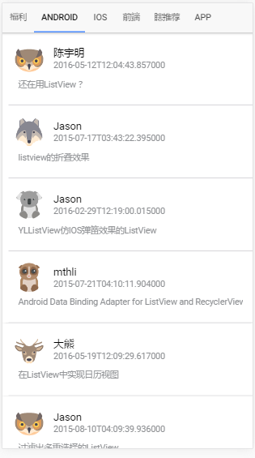

# ionic3_angular4_Gank
一个使用ionic3和angular4开发的妹子客户端

#### 前言： ####

最近找Android工作不容易找，逼的我这个android已经入行前端快半年了，这个模块算是我IM-Video其中的一个模块尝试用ionic做了混合开发，打开界面使用生产模式还是有点慢，毕竟无法达到秒开。

#### 技术点： ####

- 简单的使用http模块联网，解析数据
- 使用第三方module([ionic2-super-tabs](https://github.com/zyra/ionic2-super-tabs))增强UI，做tabUI
- 使用list，grid,progress简单布局

#### UI ####

